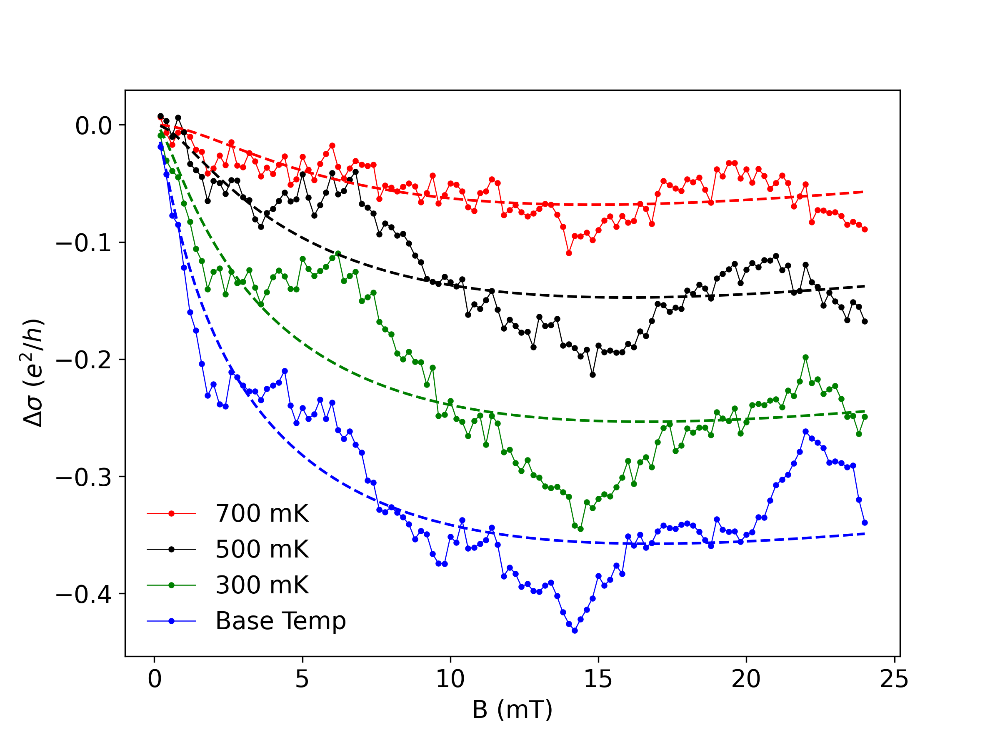

# Twisted Bilayer Graphene Spin-Orbit Parameter Statistical Analysis

TLDR;

We find evidence for spin-orbit coupling in twisted bilayer graphene with WSe$_2$ stacked on top. This is found through something called a weak antilocalization peak (a peak at 0 magnetic field that diminishes by a few 10s of mT) that disappears with temperature.

We estimate the parameters $\tau_{asy}, \tau_{sym}$. Although they are hard to estimate, due to some uncertainty in experimentally derived values, we can do an approximate order-of-magnitude analysis with the results:

- $\tau_{asy}$ $\sim$1-10 picoseconds (ps)
- $\tau_{asy}$ in the same range but almost always smaller
- The ratio between them can give us an approximate ratio between so-called Rashba spin-orbit coupling, which is symmetric, and Ising spin-orbit coupling, which is asymmetric. This ratio is of order $\sim$1-3