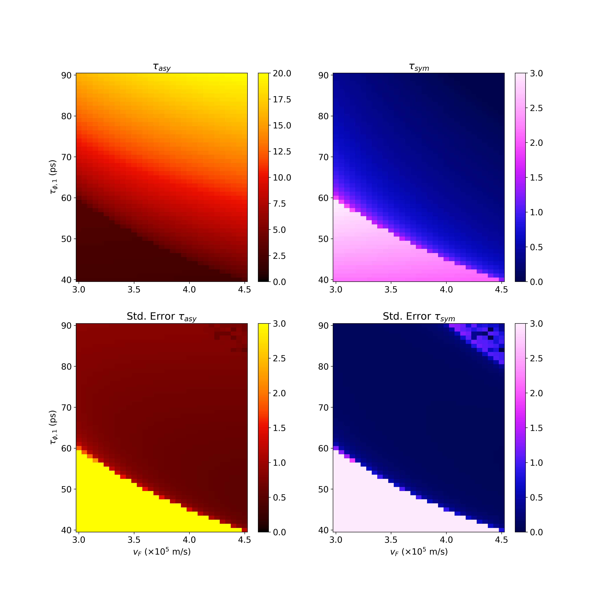
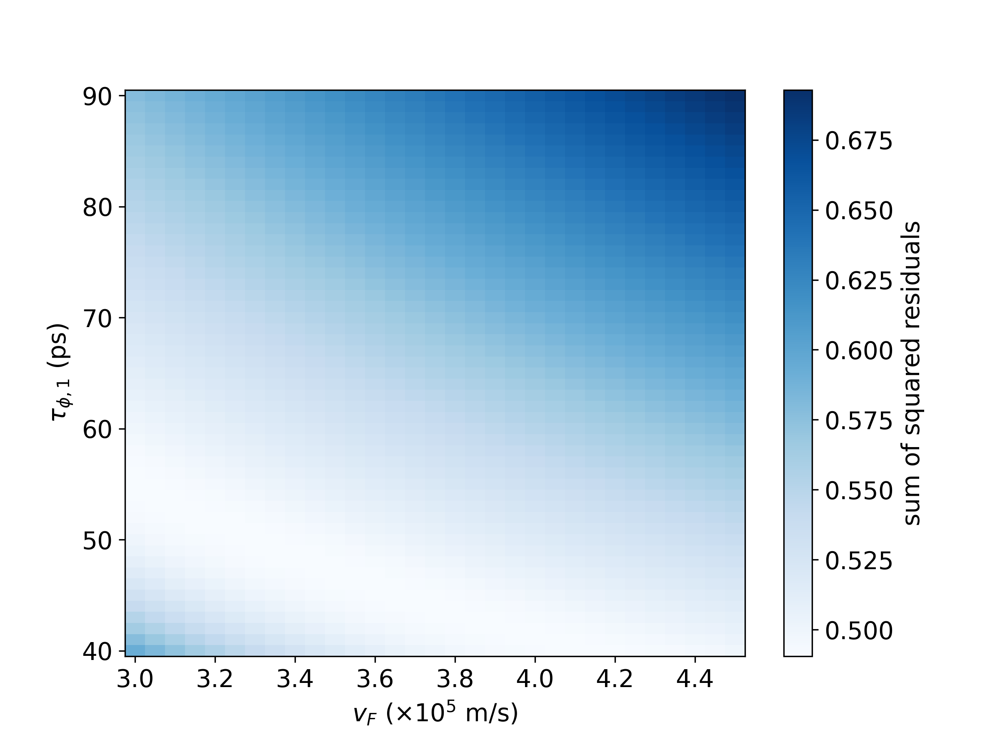

# Twisted Bilayer Graphene Spin-Orbit Parameter Statistical Analysis

TLDR; We find evidence for spin-orbit coupling in twisted bilayer graphene with WSe$_2$ stacked on top. This is found through something called a weak antilocalization peak (a peak at 0 magnetic field that diminishes by a few 10s of mT) that disappears with temperature. We clean the data to provide peaks as shown with the connected dots below and fit the data, as shown with the apppropriately colored dotted lines.

## More details:

Spin-orbit coupling arises from electron spins coupling to their orbits around ions, which generates an effective magnetic field. This messes with the energy levels of electrons and can have a number of effects. 

The effect we are concerned with here is called weak antilocalization. Usually, electrons are somewhat favored to take cyclic paths back to their starting points, resulting in electron transport being resistive. This is called weak localization, and the resistance tends to decrease at a small magnetic field is applied that scatters electrons and disfavors cyclic paths.

However, when the material has spin-orbit coupling, electrons with opposite spins tend to form cyclic paths (shown in the figure below with blue and red paths being electrons with opposite spins) in opposite directions. The opposite paths tend to cause destructive interference, increasing conductivity this time. The increased conductivity diminishes with a small magnetic field that knocks the electrons off their paths. This effect is called weak ANTIlocalization, which is what we observe here.

Spin-orbit coupling can be represented by various scattering times $\tau$, which form a sort of average time before spins are scattered. Smaller scattering times mean larger spin-orbit coupling.

Through some equations for graphene that we have modified to work for twisted bilayer graphene, we estimate the parameters $\tau_{asy}, \tau_{sym}$. Although they are hard to estimate, due to some uncertainty in experimentally derived values, we can do an approximate order-of-magnitude analysis with the results:

- $\tau_{asy}$ ~1-10 picoseconds (ps)
- $\tau_{sym}$ in the same range but almost always smaller
- These values allow for an order-of magnitude estimate 
- The ratio between them can give us an approximate ratio between so-called Rashba spin-orbit coupling, which is symmetric, and Ising spin-orbit coupling, which is asymmetric. This ratio is of order $\sim$1-3

The main difficulties we dealt with: 

- The two scattering times we find are correlated. We can see this in the plots below, which are 2D confidence interval plots, derived from F-tests where parameters are varied from the best-fit parameters and evaluated based on fit. First is the plot for parameter values $v_F = 4.5\times10^5$ m/s, $\tau_{\phi, 1} = 40.5$ ps.

Next is the plot for slightly different parameter values $v_F = 4.5\times10^5$ m/s, $\tau_{\phi, 1} = 40.5$ ps, where we see that there is a more reasonable minimum.

- Certain parameters we plug into the equation, $v_F$ or Fermi velocity, and $\tau_{\phi}$ or the electron coherence scattering time, are only approximately known. Furthermore, the minimization procedure becomes unstable for certain reasonable ranges of these parameters, and we have to estimate close to this boundary. We can see this in the next figure, where we see the minimizer's standard errors blow up at the bottom left side of the diagrams. However, just to the upper right of this line is where we expect the model to work best, as shown in the next graph, and due to our experimental estimates on $v_F$ and $\tau_{\phi}$. The estimates above come from these values.

In this figure, the colors represent best-fit values for the parameters in the titles.

This is a graph showing minimized residuals close to the line where the model becomes unstable.

